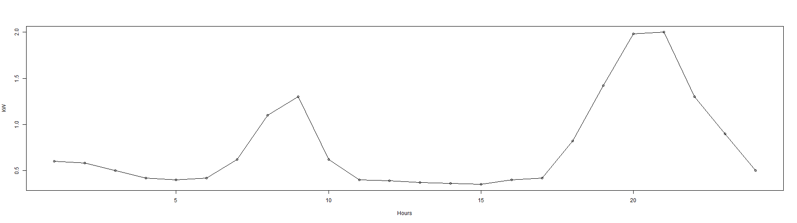

Predicting the daily electricity consumption of your house
========================================================
author: Daniel A. Broden
date: Wed Jan 21 18:27:55 2015
Try out my application at <http://danbro.shinyapps.io/LoadPrediction>

The General idea
========================================================
The idea was to create a simplified prediction model to showcase the daily electricity consumption of a house. The model takes as input the following predictors:

- Number of house occupants
- Approximative house area
- Type of day

Weights are attributed to the user inputs and added to a base case load profile taken from the following source: <http://goo.gl/czCniC>

N.B: the weights have been chosen arbitrarly for the purpose of demonstration

The Model
========================================================
The following initial values are hard coded into server.R before calling shinyServer()


```r
load <- c(0.6, 0.58, 0.5, 0.42, 0.4, 0.42, 0.62, 1.1, 1.3, 0.62, 0.4, 0.39, 0.37, 0.36, 0.35, 0.4, 0.42, 0.82, 1.42, 1.98, 2, 1.3, 0.9, 0.5)

weekendload <- c(0.6, 0.58, 0.5, 0.42, 0.4, 0.42, 0.62, 1.1, 1.3, 1.2, 1.1, 0.9, 0.87, 0.86, 0.88, 0.89, 0.92, 0.97, 1.42, 1.98, 2, 1.3, 0.9, 0.5)

k1 <- 0.25 # rate of change of occupant increase [kW] (chosen arbitrarly)
k2 <- 1 # rate of change of size increase [kW] (chosen arbitrarly)
```

The Model
========================================================
The following plot shows an example of the daily base load

 

Possible Extensions
========================================================

We could add a lot more features to improve our Shiny app in future work.
Some examples are listed below:
- Improve the accuracy of our model
- Add more selections in the sidebar panel
- Add a comparative curve in the figure showing the average daily load profile
- Include a submit button in the sidebar panel while still keeping the sliderbar reactive (i.e., it is independent of the submit button)

You can try out the applications at this link <http://danbro.shinyapps.io/LoadPrediction>
